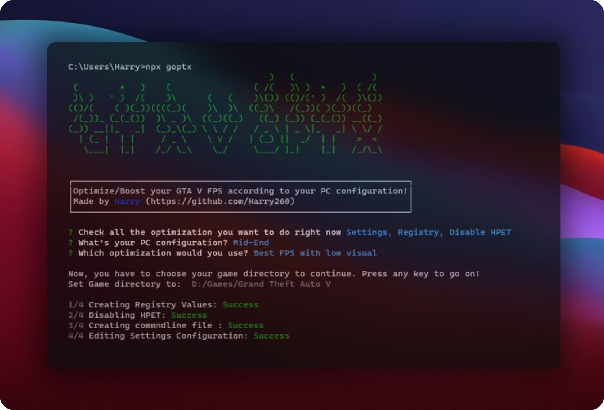

# GTA V OPT-X

Optimize/Boost your GTA V FPS according to your PC configuration! You just need NodeJS preinstalled. This works with GTA V online/offline on **Steam, EpicGames, Rockstar** and any other version!



# Usage

After installing NodeJS, just run the below command to get started. After that proceed with your prefered configuration.

```npm
npx goptx
```

# Support

If you found this useful, consider buying me a coffee and starring this repo ⭐<br>
<br>
<a href="https://www.buymeacoffee.com/harrytom" target="_blank"></a><br>
<br>

<hr>

This was inspired by ▶️ [GTA V: Dramatically increase performance / FPS with any setup! / Best Settings! GTA 5 Ceyo Perico by Panjno](https://www.youtube.com/watch?v=XvAueyGJTt0)
